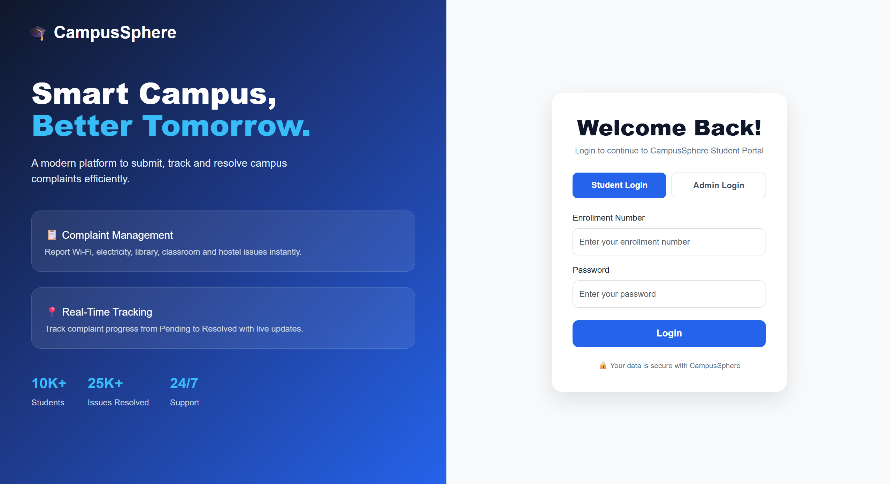
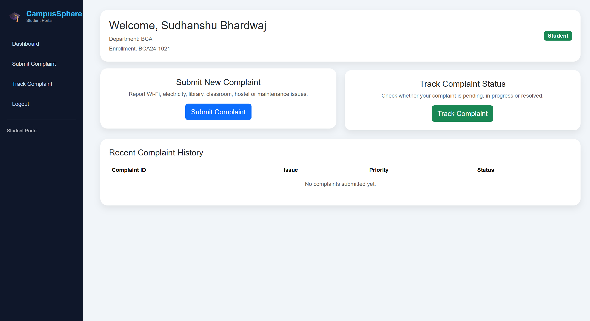
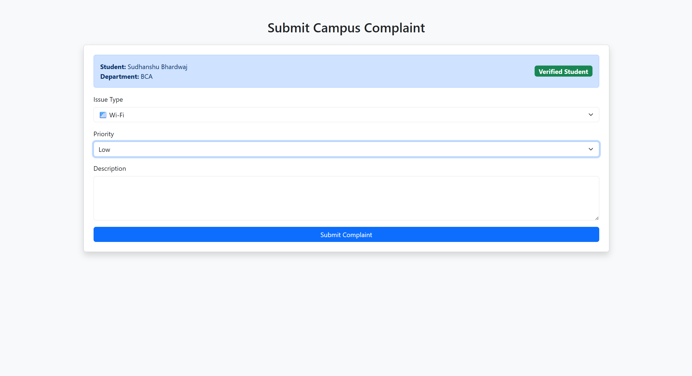
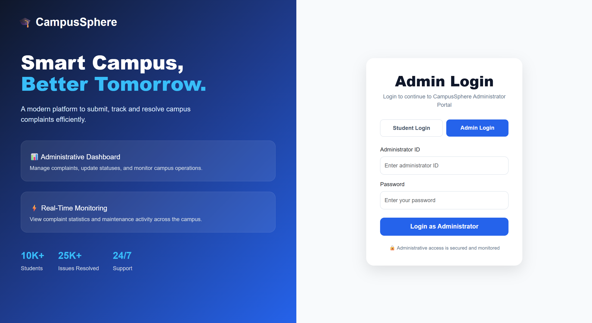
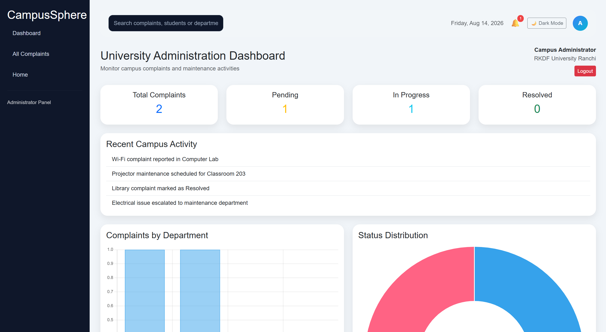
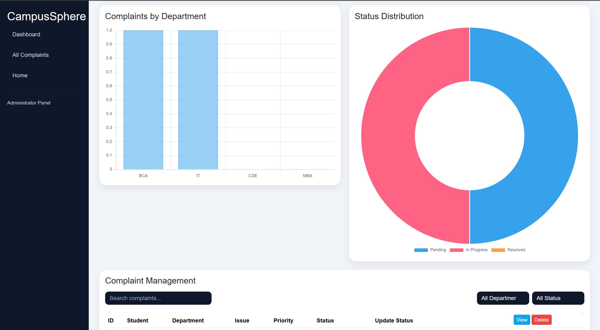
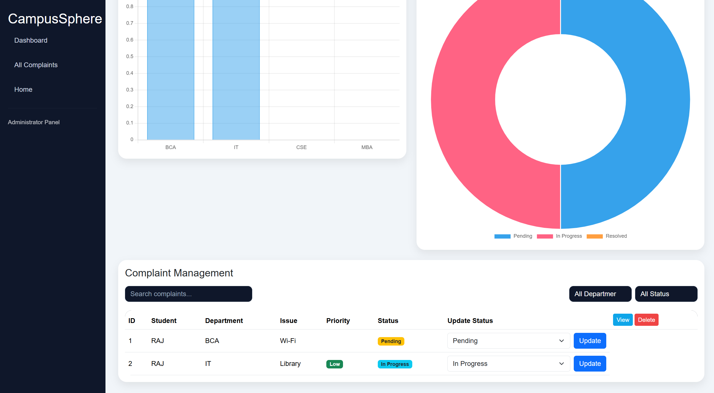

# 🎓 CampusSphere - Smart Campus Management System

A web-based complaint management system for universities built using **Java, Spring Boot, Thymeleaf, Bootstrap, and MySQL**.

## 🚀 Features

- Student Login Dashboard
- Admin Login Dashboard
- Submit Campus Complaints
- Track Complaint Status
- Complaint Management Panel
- Department Analytics
- Dark Mode
- Responsive UI

## 🛠️ Tech Stack

- Java
- Spring Boot
- Spring MVC
- Thymeleaf
- Bootstrap 5
- MySQL
- HTML / CSS / JavaScript

## 📸 Screenshots

### Student Login

### Student Dashboard

### Complaint Form

### Admin Login

### Admin Dashboard

## ▶️ Run Locally

1. Clone the repository
2. Configure MySQL in `application.properties`
3. Run `SmartcampusApplication`
4. Open `http://localhost:8080`

## 👨‍💻 Author

**Sudhanshu Bhardwaj**